# DeepSeek Harness

English | [中文](README.zh.md)

<p align="center">
  
</p>

<p align="center">
  <strong>Everything is a plugin.</strong> One Cordis-powered runtime carries the agent loop, the tools, and the Web UI — compose it, extend it, replace it.
</p>

<p align="center">
  <a href="https://www.npmjs.com/package/@deepseek-ai/dsh"></a>
  <a href="LICENSE"></a>
  <a href="docs/development.md"></a>
  <a href="https://github.com/deepseek-ai/deepseek-harness/commits"></a>
  <a href="https://github.com/deepseek-ai/deepseek-harness/stargazers"></a>
  <a href="https://discord.gg/Ycq5dCaS4"></a>
</p>

DeepSeek Harness (`dsh`) is an open-source agent harness developed by [DeepSeek AI](https://deepseek.com).

It is built on an **everything-is-a-plugin** architecture and powered by [Cordis](https://github.com/cordiverse/cordis), whose design is described in [_A Programming Paradigm for Spatiotemporal Composability_](https://arxiv.org/abs/2608.25512).

Documentation: [https://deepseek-harness.github.io/deepseek-harness/](https://deepseek-harness.github.io/deepseek-harness/)

## Highlights

| | |
| --- | --- |
| 🔌 **Everything is a plugin** | The agent loop, tools, and Web UI are all Cordis plugins composed through `cordis.yml` — extend or replace any part without forking the loop. |
| 🖥️ **Web UI included** | `dsh web` serves a local Web UI with sessions, plans, and approval-gated tool calls. |
| 🧭 **Several control surfaces** | The same runtime drives the Web UI, an ACP automation server, and one-shot headless CLI tasks. |
| 🧾 **Replayable session logs** | Everything the model saw is reconstructable from the session log; transcripts replay keylessly in snapshot tests. |
| 🧰 **Two SDKs, one loop** | The TypeScript and Python SDKs project the same agent-loop surface. |
| 🔒 **Sandboxed execution** | Tool subprocesses run on Linux under landlock isolation through a native Node addon. |

## Developer preview

DeepSeek Harness is in _developer preview_ and iterating rapidly. **THERE WILL BE COMPATIBILITY-BREAKING CHANGES.**

Review the [safety notice](SAFETY.md) before running the project.

## Run

### Run from `npm`

Install `Node.js` (`^22.19 || >=24`), then run:

```sh
npx @deepseek-ai/dsh web
```

The command starts the Web UI at `http://127.0.0.1:3080` by default and opens it in the default browser for a local launch. An SSH launch only prints the host URL because the SSH client or editor owns the local forwarded address. Pass `--no-open` to run the server without opening a browser. See [Web UI guide](docs/user/guide/index.md).

### Run from source

To run from a repository checkout:

```sh
git clone https://github.com/deepseek-ai/deepseek-harness.git
cd deepseek-harness
pnpm install
pnpm run build
pnpm dsh web
```

`pnpm run build` prepares the repository artifacts. `pnpm dsh web` uses those built artifacts without rebuilding.

## Documentation

| Topic | Guide |
| --- | --- |
| Web UI | [Web UI guide](docs/user/guide/index.md) |
| Model configuration | [Model providers guide](docs/user/guide/providers.md) |
| Python SDK | [Python SDK guide](docs/user/guide/python-sdk.md) |
| Plugin development | [Extension cookbook](docs/cookbook/extension-cookbook.md) |

## Community and support

- Submit feedback or bug reports through [GitHub Discussions](https://github.com/deepseek-ai/deepseek-harness/discussions).
- Add the [`dsh-plugin`](https://github.com/topics/dsh-plugin) topic to your plugin repository for discoverability.
- Join <a href="https://discord.gg/Ycq5dCaS4">DeepSeek Harness Discord community</a>.

## Contributing

See [CONTRIBUTING.md](CONTRIBUTING.md).

## Development

Start with the [development guide](docs/development.md) and [architecture documentation](docs/architecture.md).

For agents, follow [AGENTS.md](AGENTS.md).

## License

[MIT](LICENSE)

Third-party dependencies and their licenses are disclosed in [THIRD_PARTY_NOTICES.md](THIRD_PARTY_NOTICES.md).
